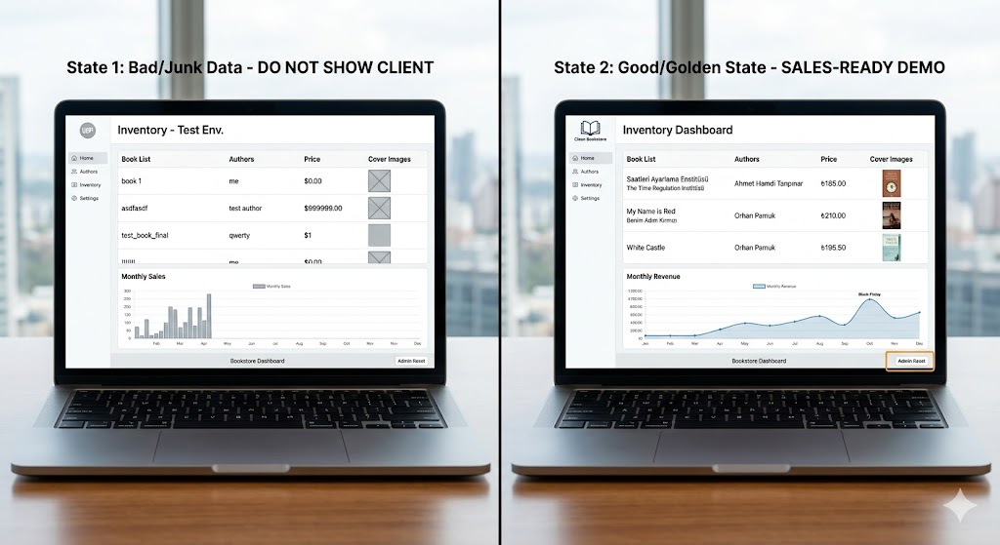

# Clean Bookstore - B2B Sales Demo App

**Clean Bookstore** is a professional iOS demonstration application designed for sales representatives to showcase a robust inventory management system. The project highlights a "Reset Mechanism" that allows a user to instantly transform a corrupted, data-heavy test environment into a perfect, sales-ready "Golden State."

  

---

## 🚀 Core Objective
The primary goal of this app is to demonstrate **system resilience and data integrity**. It allows developers or sales reps to:
1.  **Inject Junk Data:** Simulate a "real-world" scenario where data might be messy or unoptimized (Stress Test).
2.  **Instant Recovery:** Demonstrate a one-tap restoration to a high-quality "Golden State" for clean presentations.

---

## 🛠 Tech Stack & Architecture
- **Language:** Swift 5.10+
- **Framework:** SwiftUI
- **Charts:** Native SwiftUI Charts (iOS 16+)
- **Architecture:** MVVM (Model-View-ViewModel)
- **Principles:** SOLID, Clean Code, Single Responsibility.

---

## 📂 Codebase Structure

### 1. Models (`Models.swift`)
- **User:** Handles authentication and role-based permissions (`.admin` vs `.customer`).
- **Book:** The core data entity, supporting both static asset images and dynamic `Data` from the photo library.
- **Stat:** A reusable model for plotting analytics in Bar and Line charts.

### 2. ViewModels (Separation of Concerns)
- **AuthenticationViewModel:** Manages the login/signup lifecycle and the `currentUser` session.
- **InventoryViewModel:** The "brain" of the app. It holds the book list and contains the logic for the **Stress Test** (random junk generation) and the **Admin Reset** (restoration to golden data).
- **AnalyticsViewModel:** Manages the data for sales and revenue charts, supporting both "Junk" and "Golden" trending states.

### 3. Views (UI Layers)
- **RootView:** The central router. It listens to the `AuthenticationViewModel` and decides whether to show the Login screen, the Admin Dashboard, or the Customer Dashboard.
- **AdminDashboardView:** A comprehensive panel for management.
    - Includes **Sales Analytics Charts** (BarMark).
    - Features an editable inventory list with **Swipe-to-Delete** functionality.
    - Contains the magic **Stress Test** and **Admin Reset** controls.
- **CustomerDashboardView:** A polished e-commerce storefront.
    - Shows **Market Insight Charts** (BarMark).
    - Features a **Shopping Cart** system with **Checkout Simulation**.
    - Displays the collection with high-quality book covers and "Add to Cart" functionality.
- **AddBookView:** Utilizes `PhotosUI` and `PhotosPicker` to allow admins to upload real book covers from the device gallery.
- **EditBookView:** Allows granular editing of book titles, authors, prices, and images.

---

## 🔑 Key Features
- **Role-Based Routing:** Different UI and data visibility for Admins and Customers.
- **Photo Library Integration:** Real-world capability to add custom imagery to the database.
- **Dynamic Analytics:** Charts that update in real-time to reflect the "health" of the system.
- **Unified Scrolling:** The Admin Dashboard uses a streamlined `ScrollView` + `ForEach` architecture for a smooth user experience.

---

## 📖 How it Works
1.  **Start:** The app launches to the `LoginView`.
2.  **Role Play:** 
    - Type **"admin"** to enter the management side.
    - Type anything else (or Sign Up) to enter as a **customer**.
3.  **The Demo:** 
    - As an Admin, tap **"Stress Test"**. Watch the inventory fill with junk and the Revenue chart become erratic.
    - Tap **"Admin Reset"**. Watch the system instantly transition to a perfect state with trending growth and curated books.
    - Switch to the Customer view to see how the clean state provides a beautiful user experience.
